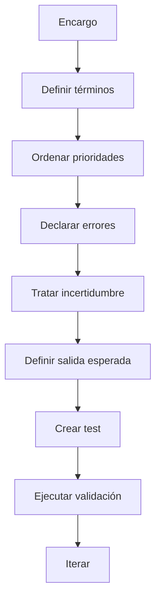
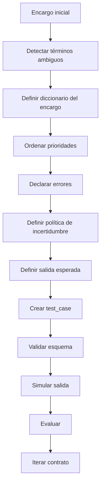
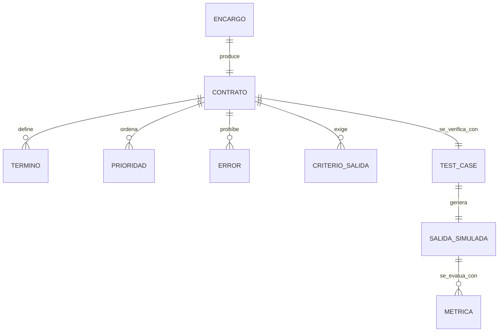

# Repositorio GitHub sobre Contratos semánticos temporales

## Resumen ejecutivo

La propuesta que sigue diseña un repositorio GitHub completo, en español y listo para publicar, para convertir la idea de los **contratos semánticos temporales** en una práctica reproducible de trabajo con modelos de IA. La base conceptual es sólida: la semántica estudia el significado codificado de las expresiones; la pragmática estudia cómo intervienen intención, contexto y situación comunicativa; y la teoría de los actos de habla y la implicatura muestra que decir algo no equivale solo a su contenido literal, sino también a lo que hace y sugiere en contexto. Ese fondo teórico encaja de forma natural con un problema actual de prompting: los modelos responden mejor cuando se explicitan criterios, formato, éxito esperado y límites del error, pero siguen necesitando evaluaciones, ejemplos y estructuras de salida para que la respuesta no dependa de ambigüedades implícitas. citeturn4search3turn4search12turn4search1turn9search1turn9search5turn3search3turn3search7turn3search2turn0search8turn1search3

Por eso, el repositorio no trata “contrato semántico temporal” como una etiqueta académica cerrada, sino como un **marco operativo**: un documento corto, situado y versionable que fija qué significan ciertos términos dentro de una tarea, qué prioridades mandan si hay conflicto, qué se considera error, cómo se trata la incertidumbre y qué criterios permiten aceptar o rechazar una salida. La estructura propuesta separa teoría, práctica, plantillas, ejemplos, esquemas, scripts, tests y materiales didácticos, siguiendo además las convenciones oficiales de GitHub para README, CONTRIBUTING, plantillas de issues y pull requests, comunidad y workflows. citeturn7search1turn7search0turn6search5turn6search16turn6search0turn7search11

La recomendación de licencia es **MIT** porque GitHub y Choose a License la describen como una licencia permisiva, breve y fácil de reutilizar, con la condición principal de conservar el aviso de copyright y la licencia. Si el proyecto evolucionara hacia una librería con una preocupación fuerte por patentes, Apache 2.0 sería una alternativa razonable; pero, para un repositorio formativo y de plantillas, MIT encaja muy bien. citeturn8search5turn8search0turn8search1

En dominios sensibles como salud, educación, empleo o justicia, el repositorio incorpora revisión humana explícita y límites de uso. Esa cautela está alineada con guías institucionales: la OMS advierte sobre los riesgos y principios éticos de la IA en salud, y el marco europeo de IA trata como alto riesgo varios usos en sanidad, educación, empleo y justicia, con exigencias de control de riesgos e intervención humana. citeturn5search0turn5search1turn5search5turn12search1turn12search3turn12search18

## Hallazgos de investigación y criterios de diseño

El repositorio se apoya en una idea simple: cuando una instrucción contiene términos como “claro”, “profesional”, “neutral”, “breve” o “riguroso”, el modelo necesita **desambiguación operativa**. Eso no sale solo de la semántica literal. La RAE distingue entre significado codificado y sentido dependiente del contexto; el Instituto Cervantes describe la competencia pragmática como la capacidad de usar la lengua atendiendo también a interlocutores y situación; y la literatura filosófica sobre actos de habla e implicatura recuerda que una misma formulación puede ejecutar acciones distintas y sugerir más de lo que literalmente dice. Esa es la justificación teórica para crear contratos temporales, situados y explícitos. citeturn4search12turn4search1turn4search6turn9search1turn9search0turn9search5

La parte práctica del diseño viene de tres frentes complementarios. OpenAI insiste en que el prompting eficaz requiere instrucciones claras, formato deseado y criterios concretos; Anthropic recomienda definir criterios de éxito y construir evaluaciones; y Google aconseja preparar conjuntos de entradas y salidas esperadas, y evaluar manualmente o con jueces automáticos. Además, las salidas estructuradas con JSON Schema ayudan a que el modelo respete forma y claves obligatorias, aunque no resuelvan por sí solas la ambigüedad semántica del encargo. De ahí que el repositorio combine teoría lingüística, plantillas Markdown, plantillas JSON/YAML, esquemas, tests y CI. citeturn3search0turn3search3turn3search7turn3search2turn0search5turn0search8turn1search3

También se han incorporado criterios de mantenibilidad de GitHub. Las guías oficiales indican que GitHub reconoce README en la raíz, `.github` o `docs`; que `CONTRIBUTING.md` puede ubicarse en raíz, `docs` o `.github`; que los formularios de issues viven en `.github/ISSUE_TEMPLATE`; que la plantilla de PR se muestra automáticamente en el cuerpo del pull request; y que los workflows de Actions se definen en YAML dentro de `.github/workflows`. Esa convención reduce fricción para contribuyentes y facilita que el repositorio pueda usarse como **template repository**. citeturn7search15turn7search0turn6search2turn6search5turn6search16turn6search0turn7search6

## Arquitectura del repositorio propuesto

La siguiente estructura prioriza cuatro cosas: que se entienda rápido, que se pueda usar tal cual, que sea fácil de enseñar y que tenga pruebas mínimas desde el primer día.

| Ruta | Función principal |
|---|---|
| `README.md` | Entrada al proyecto: objetivo, público, uso rápido y mapa del repo |
| `docs/` | Marco teórico, guía práctica, casos de uso, evaluación y bibliografía |
| `templates/` | Plantillas base en Markdown, JSON y YAML |
| `examples/` | Seis dominios aplicados con prompt, contrato, salida esperada y tests |
| `schemas/` | Esquema JSON para validar contratos |
| `scripts/` | Validación, simulación y ejecución de tests |
| `tests/` | Pruebas de esquema, prioridades y presencia de ejemplos |
| `assets/` | Diagramas mermaid y panel de traducción |
| `training/` | Slides, ejercicios, rúbrica y checklist de auditoría |
| `.github/` | Plantillas de issues/PR y workflows de CI |
| `LICENSE` y `CONTRIBUTING.md` | Apertura legal y guía de contribución |

La estructura usa exactamente las piezas que GitHub expone como recomendables para documentación, contribución y automatización, y añade una capa de evaluación porque la literatura reciente de prompting insiste en que el comportamiento de un sistema con LLM debe medirse con casos de prueba y criterios de éxito observables, no solo con “sensación de que responde mejor”. citeturn7search17turn7search11turn7search0turn6search0turn6search11turn3search7turn0search8turn1search3

### Árbol de archivos completo

```text
contratos-semanticos-temporales/
├── .github/
│   ├── ISSUE_TEMPLATE/
│   │   ├── bug.yml
│   │   ├── nuevo_caso_de_uso.yml
│   │   └── config.yml
│   ├── workflows/
│   │   ├── validate-contract-presence.yml
│   │   ├── lint-json-yaml.yml
│   │   └── run-example-tests.yml
│   └── PULL_REQUEST_TEMPLATE.md
├── assets/
│   ├── diagramas/
│   │   ├── flujo-creacion.mmd
│   │   └── relacion-entidades.mmd
│   ├── panel-traduccion.md
│   └── panel-traduccion.csv
├── docs/
│   ├── guia-teorica.md
│   ├── guia-practica.md
│   ├── casos-de-uso.md
│   ├── evaluacion.md
│   └── bibliografia.md
├── examples/
│   ├── corporativo/
│   │   ├── README.md
│   │   └── test_case.json
│   ├── ux-producto/
│   │   ├── README.md
│   │   └── test_case.json
│   ├── periodismo/
│   │   ├── README.md
│   │   └── test_case.json
│   ├── investigacion-academica/
│   │   ├── README.md
│   │   └── test_case.json
│   ├── salud/
│   │   ├── README.md
│   │   └── test_case.json
│   └── legal/
│       ├── README.md
│       └── test_case.json
├── schemas/
│   └── contrato.schema.json
├── scripts/
│   ├── validate_contracts.py
│   ├── check_pr_semantic_contract.py
│   ├── simulate_model.py
│   ├── run_example_tests.py
│   └── build_slides_pdf.sh
├── tests/
│   ├── test_contract_schema.py
│   ├── test_priority_rules.py
│   └── test_examples_presence.py
├── training/
│   ├── slides.md
│   ├── slides.pdf
│   ├── ejercicios.md
│   ├── rubrica-evaluacion.md
│   └── checklist-auditoria.md
├── .gitignore
├── CONTRIBUTING.md
├── LICENSE
└── README.md
```

## Contenido de los archivos

Los contenidos siguientes están pensados para poder copiarse directamente al repositorio. El diseño prioriza uso real antes que ornamentación.

### Archivos raíz

#### `README.md`

```markdown
# Contratos semánticos temporales

Un repositorio práctico y formativo para diseñar, documentar, probar y evaluar contratos semánticos temporales al trabajar con modelos de IA.

## Qué es esto

Un **contrato semántico temporal** es un acuerdo explícito, limitado a una tarea o contexto concreto, que define:

- qué significan ciertos términos del encargo;
- qué prioridades mandan si hay conflicto;
- qué se considera error;
- cómo debe tratarse la incertidumbre;
- qué criterios permiten aceptar o rechazar una salida.

No es una ontología general ni una guía genérica de prompting. Es una pieza operativa para reducir ambigüedad y hacer que una interacción con IA sea más verificable.

## Objetivo

Ayudar a equipos, docentes, periodistas, diseñadores, juristas, personal sanitario e investigadores a pasar de instrucciones vagas a contratos verificables.

## Público

- Personas que ya usan IA y necesitan más control sobre el significado.
- Equipos que quieren estandarizar prompts y revisiones.
- Docentes y formadores que necesitan material didáctico.
- Organizaciones que quieren documentar criterios, límites y auditorías.

## Qué encontrarás

- Guía teórica sobre semántica, pragmática y prompting.
- Guía práctica para redactar contratos.
- Plantillas en Markdown, JSON y YAML.
- Casos aplicados en 6 dominios.
- Esquema JSON y scripts de validación.
- Tests automáticos y CI en GitHub Actions.
- Material formativo y checklist de auditoría semántica.
- Panel de traducción: “lo que decimos” vs “lo que deberíamos decir”.

## Uso rápido

### Leer primero
1. `docs/guia-teorica.md`
2. `docs/guia-practica.md`
3. `templates/contrato-semantico.md`

### Validar ejemplos
```bash
python -m pip install -U jsonschema pyyaml pytest
python scripts/run_example_tests.py
pytest
```

### Crear tu primer contrato
1. Duplica una plantilla de `templates/`.
2. Define el diccionario del encargo.
3. Ordena prioridades.
4. Declara errores.
5. Explica cómo tratar la incertidumbre.
6. Añade criterios de salida.
7. Crea un caso de prueba en `examples/`.

## Flujo recomendado



## Estructura del repositorio

```text
docs/        marco conceptual y operativo
templates/   plantillas reutilizables
examples/    casos por dominio
schemas/     validación estructural
scripts/     automatización
tests/       pruebas
assets/      diagramas y paneles
training/    material didáctico
```

## Principios del proyecto

- Claridad antes que retórica.
- Contratos pequeños antes que mega-instrucciones.
- Hechos, inferencias y vacíos bien separados.
- Evaluación visible desde el primer commit.
- Revisión humana en dominios sensibles.

## Licencia

MIT. Consulta `LICENSE`.

## Cómo contribuir

Lee `CONTRIBUTING.md` y usa las plantillas de issues y pull requests.
```

#### `CONTRIBUTING.md`

```markdown
# Guía de contribución

Gracias por contribuir.

## Qué esperamos

Este repositorio acepta contribuciones en cinco frentes:

- mejora teórica y bibliográfica;
- mejora de plantillas;
- nuevos casos de uso;
- mejora de tests y scripts;
- materiales formativos.

## Reglas básicas

1. Todo cambio práctico debe hacer explícito su contrato semántico.
2. Todo ejemplo nuevo debe incluir:
   - `README.md` con prompt y salida esperada;
   - `test_case.json`;
   - términos ambiguos definidos;
   - errores prohibidos;
   - tratamiento de incertidumbre.
3. No se aceptan ejemplos que normalicen invenciones o “relleno”.
4. En salud y legal, el ejemplo debe exigir revisión humana.
5. Si añades bibliografía, prioriza:
   - fuentes primarias;
   - textos en español;
   - documentación oficial.

## Estilo de redacción

- Español claro.
- Frases concretas.
- Evita jerga inflada.
- Si una palabra como “profesional”, “claro” o “neutral” es importante, defínela.

## Flujo mínimo de PR

1. Crea tu rama.
2. Realiza cambios.
3. Ejecuta:
   ```bash
   python scripts/run_example_tests.py
   pytest
   ```
4. Abre PR usando la plantilla.
5. Explica:
   - qué cambias;
   - qué contrato añades o alteras;
   - qué riesgo semántico reduces.

## Convenciones

### Nombres de carpetas
- minúsculas;
- guiones para separar palabras.

### Archivos JSON/YAML
- claves descriptivas;
- valores explícitos;
- nada de campos vacíos si pueden evitarse.

## Checklist antes de enviar

- [ ] El cambio es trazable.
- [ ] El contrato es explícito.
- [ ] Los tests pasan.
- [ ] No introduces términos vagos sin definir.
- [ ] La documentación acompaña al cambio.

## Preguntas frecuentes

### ¿Puedo proponer una variante del concepto?
Sí. Siempre que expliques qué problema resuelve mejor y cómo se evaluaría.

### ¿Puedo subir ejemplos empresariales reales?
Sí, si están anonimizados y no exponen datos sensibles.

### ¿Puedo añadir un caso polémico?
Sí, pero debe explicitar sus límites, riesgos y criterios de revisión humana.
```

#### `LICENSE`

```text
MIT License

Copyright (c) 2026

Permission is hereby granted, free of charge, to any person obtaining a copy
of this software and associated documentation files (the "Software"), to deal
in the Software without restriction, including without limitation the rights
to use, copy, modify, merge, publish, distribute, sublicense, and/or sell
copies of the Software, and to permit persons to whom the Software is
furnished to do so, subject to the following conditions:

The above copyright notice and this permission notice shall be included in all
copies or substantial portions of the Software.

THE SOFTWARE IS PROVIDED "AS IS", WITHOUT WARRANTY OF ANY KIND, EXPRESS OR
IMPLIED, INCLUDING BUT NOT LIMITED TO THE WARRANTIES OF MERCHANTABILITY,
FITNESS FOR A PARTICULAR PURPOSE AND NONINFRINGEMENT. IN NO EVENT SHALL THE
AUTHORS OR COPYRIGHT HOLDERS BE LIABLE FOR ANY CLAIM, DAMAGES OR OTHER
LIABILITY, WHETHER IN AN ACTION OF CONTRACT, TORT OR OTHERWISE, ARISING FROM,
OUT OF OR IN CONNECTION WITH THE SOFTWARE OR THE USE OR OTHER DEALINGS IN THE
SOFTWARE.
```

#### `.gitignore`

```gitignore
__pycache__/
.pytest_cache/
.venv/
*.pyc
.DS_Store
coverage.xml
htmlcov/
```

### Comunidad y automatización de GitHub

#### `.github/ISSUE_TEMPLATE/bug.yml`

```yaml
name: Error o incoherencia
description: Reporta un fallo conceptual, de formato, de validación o de tests.
title: "[BUG] "
labels: ["bug"]
body:
  - type: textarea
    id: problema
    attributes:
      label: Qué falla
      description: Describe el problema con precisión.
      placeholder: El test no detecta correctamente...
    validations:
      required: true

  - type: textarea
    id: contexto
    attributes:
      label: Contexto
      description: Indica archivo, dominio y condición de uso.
    validations:
      required: true

  - type: textarea
    id: esperado
    attributes:
      label: Qué esperabas
    validations:
      required: true

  - type: textarea
    id: actual
    attributes:
      label: Qué ocurrió
    validations:
      required: true

  - type: checkboxes
    id: contrato
    attributes:
      label: Comprobaciones
      options:
        - label: He revisado si el contrato semántico define los términos ambiguos.
        - label: He ejecutado los tests locales.
        - label: He comprobado si el problema afecta a dominios sensibles.
```

#### `.github/ISSUE_TEMPLATE/nuevo_caso_de_uso.yml`

```yaml
name: Nuevo caso de uso
description: Propón un nuevo ejemplo aplicado o una extensión del marco.
title: "[CASO] "
labels: ["enhancement", "case-study"]
body:
  - type: input
    id: dominio
    attributes:
      label: Dominio
      placeholder: educación, RR. HH., soporte técnico...
    validations:
      required: true

  - type: textarea
    id: problema
    attributes:
      label: Problema semántico que resuelve
      description: ¿Qué ambigüedad, conflicto o riesgo de interpretación aborda?
    validations:
      required: true

  - type: textarea
    id: propuesta
    attributes:
      label: Propuesta
      description: Describe prompt, contrato, salida esperada y criterio de evaluación.
    validations:
      required: true

  - type: checkboxes
    id: alcance
    attributes:
      label: Alcance
      options:
        - label: Incluye definición de términos.
        - label: Incluye jerarquía de prioridades.
        - label: Incluye tratamiento de incertidumbre.
        - label: Incluye tests automáticos.
```

#### `.github/ISSUE_TEMPLATE/config.yml`

```yaml
blank_issues_enabled: false
contact_links:
  - name: Discusión conceptual
    url: https://github.com/ORG/REPO/discussions
    about: Usa Discussions para debates amplios y propuestas teóricas.
```

#### `.github/PULL_REQUEST_TEMPLATE.md`

```markdown
# Pull request

## Qué cambia
Describe el cambio en 3-6 líneas.

## Por qué cambia
Explica qué problema semántico, práctico o didáctico corrige o mejora.

## Contrato semántico afectado
- Archivo(s):
- Términos redefinidos:
- Prioridades alteradas:
- Errores añadidos o retirados:
- Criterios de salida afectados:

## Evidencia
- [ ] He ejecutado `python scripts/run_example_tests.py`
- [ ] He ejecutado `pytest`
- [ ] He actualizado docs si cambia el significado operativo
- [ ] He añadido o actualizado un contrato semántico temporal cuando era necesario
- [ ] He señalado revisión humana si el caso es de salud o legal

## Riesgos
Indica si este cambio puede romper ejemplos, tests o interpretaciones previas.

## Notas para revisión
Añade aquí cualquier decisión discutible o punto abierto.
```

#### `.github/workflows/validate-contract-presence.yml`

```yaml
name: validar-presencia-contrato

on:
  pull_request:
    branches: [main]

jobs:
  validar:
    runs-on: ubuntu-latest
    steps:
      - name: Checkout
        uses: actions/checkout@v4

      - name: Configurar Python
        uses: actions/setup-python@v5
        with:
          python-version: "3.11"

      - name: Ejecutar validación
        run: python scripts/check_pr_semantic_contract.py
```

#### `.github/workflows/lint-json-yaml.yml`

```yaml
name: lint-json-yaml

on:
  push:
    branches: [main]
  pull_request:

jobs:
  lint:
    runs-on: ubuntu-latest
    steps:
      - name: Checkout
        uses: actions/checkout@v4

      - name: Configurar Python
        uses: actions/setup-python@v5
        with:
          python-version: "3.11"

      - name: Instalar dependencias
        run: |
          python -m pip install --upgrade pip
          pip install pyyaml jsonschema yamllint

      - name: Lint YAML
        run: yamllint .

      - name: Validar contratos JSON/YAML
        run: python scripts/validate_contracts.py
```

#### `.github/workflows/run-example-tests.yml`

```yaml
name: tests-ejemplos

on:
  push:
    branches: [main]
  pull_request:

jobs:
  tests:
    runs-on: ubuntu-latest
    steps:
      - name: Checkout
        uses: actions/checkout@v4

      - name: Configurar Python
        uses: actions/setup-python@v5
        with:
          python-version: "3.11"

      - name: Instalar dependencias
        run: |
          python -m pip install --upgrade pip
          pip install pytest pyyaml jsonschema

      - name: Ejecutar tests de ejemplos
        run: python scripts/run_example_tests.py

      - name: Ejecutar pytest
        run: pytest -q
```

### Documentación

#### `docs/guia-teorica.md`

```markdown
# Guía teórica

## Definición operativa

Llamamos **contrato semántico temporal** a un documento breve y versionable que fija,
para un encargo concreto, el significado operativo de términos sensibles o ambiguos y
las reglas de interpretación que un modelo debe seguir.

## Por qué hace falta

Las instrucciones humanas suelen apoyarse en contexto compartido. Los modelos no
comparten mundo; predicen texto. Por eso, expresiones como “hazlo claro”, “sé neutral”
o “que suene profesional” suelen producir resultados plausibles pero no necesariamente
alineados con la intención de quien encarga la tarea.

## Antecedentes

### Semántica
Se ocupa del significado codificado y relativamente estable de las expresiones.

### Pragmática
Se ocupa del sentido dependiente del contexto, la intención, la situación y la relación
entre interlocutores.

### Actos de habla
Una frase no solo describe; también puede prometer, pedir, advertir, ordenar o excluir.

### Implicatura
Parte de lo comunicado no está en lo dicho literalmente, sino en lo que el contexto
permite inferir.

## Relación con prompt engineering

Un prompt pide algo.
Un contrato semántico temporal define **cómo debe entenderse** lo que se pide.

### Prompt sin contrato
> Hazlo profesional, claro y breve.

### Prompt con contrato
> “Profesional” = sobrio, verificable y no comercial.
> “Claro” = entendible por perfiles no técnicos sin perder precisión.
> “Breve” = máximo 180 palabras.
> Si claridad y brevedad chocan, gana claridad.
> Es error usar clichés o promesas no demostradas.

## Qué añade frente al prompting clásico

- diccionario del encargo;
- jerarquía de prioridades;
- definición de error;
- tratamiento explícito de incertidumbre;
- criterio de salida verificable.

## Límites

- No elimina del todo la variabilidad del modelo.
- No sustituye conocimiento experto del dominio.
- Puede rigidizar en exceso si el contrato es demasiado estrecho.
- Un contrato mal definido puede formalizar un mal criterio.

## Riesgos

### Riesgo de falsa precisión
Definir mucho no equivale a entender mejor.

### Riesgo de sobrecarga
Si el contrato tiene 5 páginas, deja de ser operativo.

### Riesgo político o institucional
Un contrato puede fijar como neutral un marco que no lo es.

### Riesgo en dominios sensibles
En salud, legal, empleo o educación, el contrato debe incluir revisión humana, límites
de uso y manejo explícito de incertidumbre.

## Regla de oro

El contrato tiene que reducir ambigüedad sin matar la tarea.
```

#### `docs/guia-practica.md`

```markdown
# Guía práctica

## Cómo redactar un contrato semántico temporal

## Paso 1: delimitar la tarea
Responde a tres preguntas:
- qué salida necesitas;
- para quién;
- para qué decisión o uso real.

## Paso 2: escribir el diccionario del encargo
Define solo los términos que, si se dejan abiertos, harán que el modelo improvise.

Ejemplo:
- “claro” = entendible por un lector no especialista;
- “riguroso” = separa hecho, inferencia y opinión;
- “accionable” = cada apartado termina con una decisión o siguiente paso.

## Paso 3: ordenar prioridades
Nunca dejes que todas las exigencias pesen igual.

Ejemplo:
1. precisión;
2. utilidad;
3. tono;
4. estética.

## Paso 4: declarar errores
No digas solo lo que quieres.
Declara también lo que sería una mala salida.

Ejemplo:
- inventar datos;
- ocultar incertidumbre;
- usar lenguaje inflado;
- responder con frases genéricas.

## Paso 5: tratar la incertidumbre
Define qué debe hacer el modelo cuando falte información.

Opciones frecuentes:
- marcar pendiente;
- emitir hipótesis etiquetada;
- pedir validación humana;
- detenerse si el riesgo es alto.

## Paso 6: definir la salida
Especifica:
- formato;
- secciones;
- longitud;
- elementos obligatorios;
- elementos prohibidos.

## Plantilla mínima

```markdown
### Objetivo
...

### Audiencia
...

### Términos definidos
- “...”
- “...”

### Prioridades
1. ...
2. ...

### Errores
- ...
- ...

### Incertidumbre
- ...

### Criterios de salida
- ...
```

## Checklist rápido

- [ ] La tarea está acotada.
- [ ] Los términos vagos están definidos.
- [ ] Las prioridades están ordenadas.
- [ ] Los errores están explicitados.
- [ ] La incertidumbre tiene política.
- [ ] La salida se puede comprobar.
- [ ] Hay al menos un test.

## Qué no hacer

- usar palabras comodín sin definir;
- mezclar tono, formato y criterio de verdad;
- pedir “completo” y “brevísimo” sin jerarquizar;
- pedir naturalidad y luego exigir salida totalmente rígida sin negociar ese conflicto;
- creer que JSON resuelve por sí solo el sentido.
```

#### `docs/casos-de-uso.md`

```markdown
# Casos de uso

## Empresa

Problema típico:
“Haz una nota profesional para dirección”.

Contrato útil:
- define qué significa “profesional”;
- obliga a separar recomendación, riesgo y siguiente paso;
- prohíbe lenguaje de consultora hueco.

## Periodismo

Problema típico:
“Escribe una pieza neutral”.

Contrato útil:
- define qué significa neutralidad en ese medio;
- exige titular factual y atribución;
- distingue dato confirmado, contexto y huecos abiertos.

## Educación

Problema típico:
“Explícalo de forma sencilla”.

Contrato útil:
- “sencilla” no significa simplista;
- obliga a incluir ejemplo y contraejemplo;
- ajusta nivel por audiencia.

## Salud

Problema típico:
“Resume esto para pacientes”.

Contrato útil:
- prohíbe diagnosticar;
- exige lenguaje llano;
- obliga a incluir señales de alerta y derivación profesional;
- impone revisión humana.

## Legal

Problema típico:
“Redacta un resumen jurídico claro”.

Contrato útil:
- separa supuesto, norma, interpretación y riesgo;
- prohíbe presentar la salida como consejo definitivo;
- exige revisión profesional antes de uso externo.

## Investigación académica

Problema típico:
“Haz el estado del arte”.

Contrato útil:
- exige distinguir hallazgos, debate y lagunas;
- prohíbe citas inventadas;
- obliga a marcar lo no verificado.

## UX y producto

Problema típico:
“Dame un copy más humano”.

Contrato útil:
- define voz, restricción de longitud, fricción de usuario y objetivo de pantalla;
- prohíbe vaguedad y promesas vacías.
```

#### `docs/evaluacion.md`

```markdown
# Evaluación

## Qué se evalúa

Un contrato semántico temporal no se evalúa solo por “si suena bien”.
Se evalúa por cumplimiento observable.

## Capas de evaluación

### Estructural
- ¿el contrato tiene todos los campos?
- ¿el JSON/YAML valida contra esquema?

### Semántica
- ¿los términos críticos están definidos?
- ¿las prioridades resuelven conflictos reales?
- ¿los errores cubren fallos frecuentes?

### Comportamiento
- ¿la salida respeta orden, límites y prohibiciones?
- ¿gestiona incertidumbre como se pidió?

### Utilidad
- ¿sirve para la decisión real?
- ¿reduce rondas de corrección?

## Métricas sugeridas

| Métrica | Definición | Escala |
|---|---|---|
| Cobertura de términos | términos ambiguos definidos / términos ambiguos detectados | 0-1 |
| Cumplimiento de prioridades | reglas priorizadas respetadas / reglas priorizadas totales | 0-1 |
| Tasa de errores prohibidos | errores detectados / respuestas evaluadas | 0-1 |
| Manejo de incertidumbre | incertidumbres bien marcadas / incertidumbres detectadas | 0-1 |
| Cumplimiento de formato | validaciones de salida superadas / validaciones totales | 0-1 |
| Utilidad práctica | valoración humana de uso real | 1-5 |

## Protocolo mínimo

1. redactar contrato;
2. crear 3-10 casos de prueba;
3. fijar salida esperada;
4. ejecutar tests;
5. revisar fallos;
6. iterar.

## Qué mirar en una auditoría

- términos vagos sin definir;
- conflicto entre prioridades;
- ausencia de política de incertidumbre;
- sobrecontratación semántica;
- contradicciones entre plantilla y test.
```

#### `docs/bibliografia.md`

```markdown
# Bibliografía y fuentes

## Textos de base en semántica y pragmática

- Austin, J. L. *Cómo hacer cosas con palabras*.
- Grice, H. P. “Logic and Conversation”.
- Searle, J. R. *Speech Acts*.
- Escandell Vidal, M. V. *Introducción a la pragmática*.
- Verschueren, J. *Para entender la pragmática*.
- Yule, G. *Pragmatics*.
- Halliday, M. A. K. y Hasan, R. *Cohesion in English*.

## Recursos institucionales en español

- RAE. Glosario de términos gramaticales: “semántica”.
- RAE. Glosario de términos gramaticales: “pragmática”.
- RAE. Libro de estilo de la Justicia: “El significado y el sentido”.
- Instituto Cervantes. Diccionario de términos clave de ELE: “pragmática”.
- Instituto Cervantes. Diccionario de términos clave de ELE: “competencia pragmática”.

## Prompting, evaluación y estructura

- OpenAI. *Prompt engineering*.
- OpenAI. *Structured outputs*.
- OpenAI. *Evaluation best practices*.
- Anthropic. *Prompt engineering overview*.
- Anthropic. *Define success criteria and build evaluations*.
- Google ML Kit. *Evaluate prompt quality*.

## GitHub y colaboración

- GitHub Docs. *About READMEs*.
- GitHub Docs. *Setting guidelines for repository contributors*.
- GitHub Docs. *Configuring issue templates for your repository*.
- GitHub Docs. *Creating a pull request template for your repository*.
- GitHub Docs. *Workflow syntax for GitHub Actions*.
- GitHub Docs. *About community profiles for public repositories*.

## IA en dominios sensibles

- OMS. *Ethics and governance of artificial intelligence for health*.
- Comisión Europea. *Artificial Intelligence in healthcare*.
- AESIA. Recursos sobre sistemas de alto riesgo.
- UNESCO. *Recommendation on the Ethics of Artificial Intelligence*.
```

### Plantillas reutilizables

#### `templates/contrato-semantico.md`

```markdown
# Plantilla de contrato semántico temporal

## Identificación
- Nombre del contrato:
- Versión:
- Fecha:
- Dominio:
- Responsable:

## Objetivo
Describe qué salida se necesita y para qué uso real.

## Audiencia
¿Quién va a leer o usar la salida?

## Diccionario del encargo
Define solo los términos que cambian el resultado.

- “profesional” =
- “claro” =
- “breve” =
- “neutral” =
- “accionable” =

## Jerarquía de prioridades
Ordena de mayor a menor.

1. Precisión
2. Utilidad
3. Tono
4. Formato

## Definición de error
Será error:
- inventar datos;
- ocultar incertidumbre;
- incumplir longitud;
- usar lenguaje prohibido;
- omitir secciones obligatorias.

## Tratamiento de incertidumbre
Si falta información:
- marcar pendiente;
- no inferir como hecho;
- proponer validación humana cuando corresponda.

## Criterios de salida
- Formato:
- Longitud máxima:
- Secciones obligatorias:
- Elementos prohibidos:
- Señales de calidad:

## Observaciones
Incluye aquí trade-offs, excepciones o límites.
```

#### `templates/contrato-semantico.json`

```json
{
  "$schema": "https://json-schema.org/draft/2020-12/schema",
  "version": "1.0.0",
  "nombre": "contrato-base",
  "dominio": "general",
  "objetivo": "describir el significado operativo del encargo",
  "audiencia": "equipo de trabajo",
  "terminos": {
    "profesional": "tono sobrio, directo y verificable",
    "claro": "entendible por no especialistas sin perder precisión",
    "breve": "maximo 180 palabras salvo excepción justificada"
  },
  "prioridades": [
    { "nombre": "precision", "orden": 1 },
    { "nombre": "utilidad", "orden": 2 },
    { "nombre": "tono", "orden": 3 },
    { "nombre": "formato", "orden": 4 }
  ],
  "errores": [
    "inventar datos",
    "ocultar incertidumbre",
    "usar lenguaje vacio",
    "omitir secciones obligatorias"
  ],
  "incertidumbre": {
    "politica": "marcar vacios y no afirmar como hecho lo no verificado",
    "escalar_a_humano": false
  },
  "salida": {
    "formato": "markdown",
    "max_palabras": 180,
    "secciones": ["Contexto", "Respuesta", "Limites"],
    "prohibidos": ["sinergia", "revolucionario", "disruptivo"]
  }
}
```

#### `templates/contrato-semantico.yaml`

```yaml
version: "1.0.0"
nombre: "contrato-base"
dominio: "general"
objetivo: "describir el significado operativo del encargo"
audiencia: "equipo de trabajo"

terminos:
  profesional: "tono sobrio, directo y verificable"
  claro: "entendible por no especialistas sin perder precisión"
  breve: "máximo 180 palabras salvo excepción justificada"

prioridades:
  - nombre: "precision"
    orden: 1
  - nombre: "utilidad"
    orden: 2
  - nombre: "tono"
    orden: 3
  - nombre: "formato"
    orden: 4

errores:
  - "inventar datos"
  - "ocultar incertidumbre"
  - "usar lenguaje vacío"
  - "omitir secciones obligatorias"

incertidumbre:
  politica: "marcar vacíos y no afirmar como hecho lo no verificado"
  escalar_a_humano: false

salida:
  formato: "markdown"
  max_palabras: 180
  secciones:
    - "Contexto"
    - "Respuesta"
    - "Límites"
  prohibidos:
    - "sinergia"
    - "revolucionario"
    - "disruptivo"
```

### Esquemas, scripts y tests

La parte de validación sigue una idea respaldada por la documentación de prompting y evals: el sistema debe declarar éxito esperado y comprobarlo. Por eso el esquema JSON define estructura mínima, los scripts convierten ejemplos en pruebas repetibles y GitHub Actions ejecuta validaciones en cada push o PR. Las salidas estructuradas con JSON Schema ayudan a hacer comprobable la forma del contrato; las evaluaciones miden si además respeta prioridades y límites. citeturn3search2turn3search7turn0search8turn1search3

#### `schemas/contrato.schema.json`

```json
{
  "$schema": "https://json-schema.org/draft/2020-12/schema",
  "title": "Contrato semántico temporal",
  "type": "object",
  "required": [
    "version",
    "objetivo",
    "audiencia",
    "terminos",
    "prioridades",
    "errores",
    "incertidumbre",
    "salida"
  ],
  "properties": {
    "version": {
      "type": "string"
    },
    "nombre": {
      "type": "string"
    },
    "dominio": {
      "type": "string"
    },
    "objetivo": {
      "type": "string",
      "minLength": 10
    },
    "audiencia": {
      "type": "string",
      "minLength": 3
    },
    "terminos": {
      "type": "object",
      "minProperties": 1,
      "additionalProperties": {
        "type": "string",
        "minLength": 3
      }
    },
    "prioridades": {
      "type": "array",
      "minItems": 1,
      "items": {
        "type": "object",
        "required": ["nombre", "orden"],
        "properties": {
          "nombre": { "type": "string" },
          "orden": { "type": "integer", "minimum": 1 }
        }
      }
    },
    "errores": {
      "type": "array",
      "minItems": 1,
      "items": { "type": "string" }
    },
    "incertidumbre": {
      "type": "object",
      "required": ["politica"],
      "properties": {
        "politica": { "type": "string" },
        "escalar_a_humano": { "type": "boolean" },
        "frase_modelo": { "type": "string" }
      }
    },
    "salida": {
      "type": "object",
      "required": ["formato", "secciones"],
      "properties": {
        "formato": { "type": "string" },
        "max_palabras": { "type": "integer", "minimum": 1 },
        "secciones": {
          "type": "array",
          "minItems": 1,
          "items": { "type": "string" }
        },
        "prohibidos": {
          "type": "array",
          "items": { "type": "string" }
        }
      }
    }
  }
}
```

#### `scripts/validate_contracts.py`

```python
from __future__ import annotations

import json
from pathlib import Path

import yaml
from jsonschema import validate

ROOT = Path(__file__).resolve().parents[1]
SCHEMA_PATH = ROOT / "schemas" / "contrato.schema.json"

def load_schema() -> dict:
    return json.loads(SCHEMA_PATH.read_text(encoding="utf-8"))

def load_data(path: Path) -> dict:
    if path.suffix == ".json":
      return json.loads(path.read_text(encoding="utf-8"))
    if path.suffix in {".yml", ".yaml"}:
      return yaml.safe_load(path.read_text(encoding="utf-8"))
    raise ValueError(f"Formato no soportado: {path}")

def iter_contract_files() -> list[Path]:
    candidates = []
    for directory in [ROOT / "templates", ROOT / "examples"]:
        for path in directory.rglob("*"):
            if path.suffix in {".json", ".yml", ".yaml"}:
                candidates.append(path)
    return candidates

def extract_contract(data: dict, path: Path) -> dict | None:
    # Los test_case.json guardan el contrato bajo la clave "contract".
    if path.name == "test_case.json":
        return data.get("contract")
    # Las plantillas JSON/YAML son contratos directos.
    if path.name.startswith("contrato-semantico"):
        return data
    return None

def main() -> None:
    schema = load_schema()
    checked = 0

    for path in iter_contract_files():
        data = load_data(path)
        contract = extract_contract(data, path)

        if contract is None:
            continue

        validate(instance=contract, schema=schema)
        checked += 1
        print(f"✔ Validado: {path.relative_to(ROOT)}")

    if checked == 0:
        raise SystemExit("No se ha encontrado ningún contrato para validar.")

    print(f"Validación completada. Contratos validados: {checked}")

if __name__ == "__main__":
    main()
```

#### `scripts/check_pr_semantic_contract.py`

```python
from __future__ import annotations

import json
import os
import subprocess
from pathlib import Path

ROOT = Path(__file__).resolve().parents[1]

def get_event() -> dict:
    event_path = os.environ.get("GITHUB_EVENT_PATH")
    if not event_path:
        return {}
    return json.loads(Path(event_path).read_text(encoding="utf-8"))

def get_changed_files(base_sha: str, head_sha: str) -> list[str]:
    cmd = ["git", "diff", "--name-only", base_sha, head_sha]
    result = subprocess.run(cmd, capture_output=True, text=True, check=True)
    return [line.strip() for line in result.stdout.splitlines() if line.strip()]

def main() -> None:
    event = get_event()
    pr = event.get("pull_request", {})
    body = (pr.get("body") or "").lower()
    base_sha = pr.get("base", {}).get("sha")
    head_sha = pr.get("head", {}).get("sha")

    if not base_sha or not head_sha:
        print("Evento sin información de PR. No se aplica validación estricta.")
        return

    changed_files = get_changed_files(base_sha, head_sha)

    touches_semantic_content = any(
        path.startswith(("examples/", "templates/", "docs/")) for path in changed_files
    )
    has_contract_artifact = any(
        ("contrato" in path.lower()) or path.endswith("test_case.json")
        for path in changed_files
    )

    required_checkbox = "- [x] he añadido o actualizado un contrato semántico temporal cuando era necesario"

    if touches_semantic_content and not has_contract_artifact:
        raise SystemExit(
            "La PR modifica contenido semántico sin añadir ni actualizar un contrato o test_case.json."
        )

    if required_checkbox not in body:
        raise SystemExit(
            "La PR no marca la comprobación de contrato semántico en la plantilla."
        )

    print("✔ Presencia de contrato validada en la PR.")

if __name__ == "__main__":
    main()
```

#### `scripts/simulate_model.py`

```python
from __future__ import annotations

from typing import Any

DOMAIN_SECTIONS = {
    "corporativo": {
        "Decisión": "Propongo un piloto acotado de 6 semanas con dos equipos y criterio de éxito documentado.",
        "Beneficio": "Reduce correcciones por ambigüedad y deja trazables prioridades, errores y límites.",
        "Riesgo": "Si el contrato se vuelve demasiado largo, perderá operatividad y adopción.",
        "Siguiente paso": "Validar una plantilla común y medir rondas de revisión antes y después."
    },
    "ux-producto": {
        "Usuario": "Persona que entra por primera vez, no conoce la función y necesita orientación inmediata.",
        "Fricción": "No entiende qué puede hacer ni por qué la pantalla está vacía.",
        "Copy final": "Todavía no hay resultados. Ajusta los filtros o crea tu primer elemento.",
        "Criterio de éxito": "La pantalla se entiende en menos de 5 segundos y orienta la acción."
    },
    "periodismo": {
        "Titular": "La redacción adopta contratos semánticos para reducir ambigüedad en usos de IA.",
        "Entradilla": "El cambio busca fijar criterios de claridad, atribución y manejo de incertidumbre.",
        "Contexto": "La medida aparece tras detectar diferencias entre respuestas plausibles y respuestas verificables.",
        "Límites": "El sistema no sustituye contraste de fuentes ni edición humana."
    },
    "investigacion-academica": {
        "Pregunta": "Cómo mejorar la reproducibilidad de instrucciones dadas a modelos de lenguaje.",
        "Hallazgos": "La explicitación de criterios y tests mejora comparabilidad y revisión.",
        "Lagunas": "Faltan métricas estables para medir calidad semántica en tareas abiertas.",
        "Siguiente paso": "Crear corpus anotado de contratos y salidas evaluadas por expertos."
    },
    "salud": {
        "Información general": "El texto debe informar sin diagnosticar ni sustituir valoración clínica.",
        "Señales de alerta": "Si hay empeoramiento, dolor intenso o síntomas persistentes, consulta a un profesional.",
        "Límite": "Esta salida es orientativa y requiere revisión humana antes de uso asistencial.",
        "Siguiente paso": "Adaptar la redacción a comprensión lectora de pacientes."
    },
    "legal": {
        "Supuesto": "Se solicita un resumen inicial de cláusulas y dudas interpretativas.",
        "Norma aplicable": "Debe indicarse la base normativa o contractual relevante si está disponible.",
        "Riesgo": "Presentar la salida como consejo definitivo sería incorrecto.",
        "Revisión humana": "La salida requiere validación por profesional jurídico antes de uso externo."
    }
}

def generate_output(test_case: dict[str, Any]) -> str:
    domain = test_case["dominio"]
    expected = test_case["expected_output"]
    order = expected.get("priority_order", [])
    sections = DOMAIN_SECTIONS[domain]

    lines: list[str] = []
    for section_name in order:
        title = section_name.capitalize() if section_name.capitalize() in sections else section_name
        content = sections.get(title, f"Contenido para {title}.")
        lines.append(f"## {title}\n{content}\n")

    if not lines:
        for title, content in sections.items():
            lines.append(f"## {title}\n{content}\n")

    output = "\n".join(lines).strip()
    max_words = expected.get("max_words", 9999)

    words = output.split()
    if len(words) > max_words:
        output = " ".join(words[:max_words])

    return output

if __name__ == "__main__":
    import json
    import sys
    from pathlib import Path

    path = Path(sys.argv[1])
    test_case = json.loads(path.read_text(encoding="utf-8"))
    print(generate_output(test_case))
```

#### `scripts/run_example_tests.py`

```python
from __future__ import annotations

import json
from pathlib import Path

from simulate_model import generate_output

ROOT = Path(__file__).resolve().parents[1]
EXAMPLES = ROOT / "examples"

def check_test_case(path: Path) -> None:
    data = json.loads(path.read_text(encoding="utf-8"))
    output = generate_output(data)
    lower_output = output.lower()
    expected = data["expected_output"]

    for token in expected.get("must_include", []):
        assert token.lower() in lower_output, f"Falta token requerido '{token}' en {path}"

    for token in expected.get("must_not_include", []):
        assert token.lower() not in lower_output, f"Token prohibido '{token}' en {path}"

    order = expected.get("priority_order", [])
    last_index = -1
    for token in order:
        idx = lower_output.find(token.lower())
        assert idx != -1, f"No aparece la prioridad '{token}' en {path}"
        assert idx > last_index, f"Orden incorrecto para '{token}' en {path}"
        last_index = idx

    max_words = expected.get("max_words")
    if max_words:
        assert len(output.split()) <= max_words, f"Se supera max_words en {path}"

def main() -> None:
    files = sorted(EXAMPLES.rglob("test_case.json"))
    assert files, "No se encontraron casos de prueba."

    for path in files:
        check_test_case(path)
        print(f"✔ OK: {path.relative_to(ROOT)}")

    print(f"Ejemplos verificados: {len(files)}")

if __name__ == "__main__":
    main()
```

#### `scripts/build_slides_pdf.sh`

```bash
#!/usr/bin/env bash
set -euo pipefail

npx @marp-team/marp-cli training/slides.md --pdf --output training/slides.pdf
echo "PDF generado en training/slides.pdf"
```

#### `tests/test_contract_schema.py`

```python
import json
from pathlib import Path

from jsonschema import validate
import yaml

ROOT = Path(__file__).resolve().parents[1]
SCHEMA = json.loads((ROOT / "schemas" / "contrato.schema.json").read_text(encoding="utf-8"))

def test_template_json_valida():
    data = json.loads((ROOT / "templates" / "contrato-semantico.json").read_text(encoding="utf-8"))
    validate(instance=data, schema=SCHEMA)

def test_template_yaml_valida():
    data = yaml.safe_load((ROOT / "templates" / "contrato-semantico.yaml").read_text(encoding="utf-8"))
    validate(instance=data, schema=SCHEMA)

def test_todos_los_test_case_tienen_contrato_valido():
    for path in (ROOT / "examples").rglob("test_case.json"):
        data = json.loads(path.read_text(encoding="utf-8"))
        validate(instance=data["contract"], schema=SCHEMA)
```

#### `tests/test_priority_rules.py`

```python
import json
import sys
from pathlib import Path

ROOT = Path(__file__).resolve().parents[1]
sys.path.insert(0, str(ROOT / "scripts"))

from simulate_model import generate_output  # noqa: E402

def test_orden_de_prioridades_en_corporativo():
    path = ROOT / "examples" / "corporativo" / "test_case.json"
    data = json.loads(path.read_text(encoding="utf-8"))
    output = generate_output(data).lower()

    assert output.index("decisión") < output.index("beneficio") < output.index("riesgo") < output.index("siguiente paso")

def test_no_usa_terminos_prohibidos():
    path = ROOT / "examples" / "ux-producto" / "test_case.json"
    data = json.loads(path.read_text(encoding="utf-8"))
    output = generate_output(data).lower()
    for token in data["expected_output"]["must_not_include"]:
        assert token.lower() not in output
```

#### `tests/test_examples_presence.py`

```python
from pathlib import Path

ROOT = Path(__file__).resolve().parents[1]

def test_hay_seis_dominios_minimos():
    domains = [p for p in (ROOT / "examples").iterdir() if p.is_dir()]
    assert len(domains) >= 6

def test_cada_dominio_tiene_readme_y_test_case():
    for domain in (ROOT / "examples").iterdir():
        if not domain.is_dir():
            continue
        assert (domain / "README.md").exists()
        assert (domain / "test_case.json").exists()
```

## Ejemplos aplicados y panel de traducción

Los ejemplos por dominio cumplen la parte más útil del repositorio: muestran cómo pasar de una instrucción vaga a un contrato operativo y cómo probarlo. La selección de dominios no es arbitraria. Empresa, UX, periodismo, academia, salud y legal cubren tareas donde cambian mucho la intención, la evidencia exigible, el tono permitido y el riesgo de error. En salud y legal se añade una capa extra de revisión humana porque tanto la OMS como el marco europeo de IA subrayan la necesidad de supervisión y gestión de riesgos en usos que afectan salud o derechos. citeturn5search0turn5search3turn5search5turn5search1turn12search1turn12search3turn12search18

### Ejemplos por dominio

#### `examples/corporativo/README.md`

```markdown
# Ejemplo corporativo

## Prompt
Redacta una nota interna para dirección sobre la adopción de contratos semánticos temporales en el equipo de IA.

## Contrato resumido
- “profesional” = sobrio, directo y verificable.
- “viable” = coste y responsables identificables.
- Prioridades: precisión > utilidad > tono.
- Error: jerga vacía, promesas no demostradas, omitir riesgos.
- Incertidumbre: marcar pendientes de validación.
- Salida: Decisión, Beneficio, Riesgo, Siguiente paso.

## Salida esperada
Una nota breve para dirección que:
- recomiende una acción concreta;
- nombre un riesgo real;
- proponga el siguiente paso;
- no use lenguaje de consultora.

## Qué prueba el test
- presencia de secciones;
- orden de prioridades;
- ausencia de términos prohibidos.
```

#### `examples/corporativo/test_case.json`

```json
{
  "id": "corporativo-001",
  "dominio": "corporativo",
  "prompt": "Redacta una nota interna para dirección sobre la adopción de contratos semánticos temporales en el equipo de IA.",
  "contract": {
    "version": "1.0.0",
    "nombre": "corporativo-direccion",
    "dominio": "corporativo",
    "objetivo": "ayudar a dirección a decidir un piloto limitado",
    "audiencia": "comité de dirección",
    "terminos": {
      "profesional": "tono sobrio, directo y verificable",
      "viable": "coste asumible y responsables claros",
      "claro": "comprensible por perfiles no técnicos"
    },
    "prioridades": [
      { "nombre": "precision", "orden": 1 },
      { "nombre": "utilidad", "orden": 2 },
      { "nombre": "tono", "orden": 3 }
    ],
    "errores": [
      "usar jerga inflada",
      "prometer resultados sin evidencia",
      "omitir riesgos"
    ],
    "incertidumbre": {
      "politica": "marcar como pendiente todo dato no validado",
      "frase_modelo": "Pendiente de validación interna."
    },
    "salida": {
      "formato": "markdown",
      "max_palabras": 220,
      "secciones": ["Decisión", "Beneficio", "Riesgo", "Siguiente paso"],
      "prohibidos": ["sinergia", "revolucionario", "disruptivo"]
    }
  },
  "expected_output": {
    "must_include": ["decisión", "riesgo", "siguiente paso"],
    "must_not_include": ["sinergia", "revolucionario", "disruptivo"],
    "max_words": 220,
    "priority_order": ["decisión", "beneficio", "riesgo", "siguiente paso"]
  }
}
```

#### `examples/ux-producto/README.md`

```markdown
# Ejemplo UX y producto

## Prompt
Escribe el copy de una pantalla vacía para una herramienta B2B de analítica.

## Contrato resumido
- “humano” = natural, concreto y sin artificio emocional.
- “claro” = se entiende en menos de 5 segundos.
- Prioridades: comprensión > acción > tono > estilo.
- Error: vaguedad, slogan, exceso de marca.
- Incertidumbre: no asumir funciones que la pantalla no tiene.
- Salida: Usuario, Fricción, Copy final, Criterio de éxito.

## Salida esperada
Copy que oriente la siguiente acción sin sonar promocional.

## Qué prueba el test
- que aparezca el copy final;
- que no aparezcan promesas vacías;
- que el orden responda a comprensión primero y estilo después.
```

#### `examples/ux-producto/test_case.json`

```json
{
  "id": "ux-001",
  "dominio": "ux-producto",
  "prompt": "Escribe el copy de una pantalla vacía para una herramienta B2B de analítica.",
  "contract": {
    "version": "1.0.0",
    "nombre": "ux-empty-state",
    "dominio": "ux-producto",
    "objetivo": "orientar al usuario ante una pantalla vacía",
    "audiencia": "usuario nuevo de producto",
    "terminos": {
      "humano": "lenguaje natural, adulto y concreto",
      "claro": "se entiende en menos de 5 segundos",
      "accionable": "indica una siguiente acción visible"
    },
    "prioridades": [
      { "nombre": "comprension", "orden": 1 },
      { "nombre": "accion", "orden": 2 },
      { "nombre": "tono", "orden": 3 },
      { "nombre": "estilo", "orden": 4 }
    ],
    "errores": [
      "usar slogans",
      "prometer resultados",
      "explicar una función inexistente"
    ],
    "incertidumbre": {
      "politica": "si falta un detalle de interfaz, no lo inventes"
    },
    "salida": {
      "formato": "markdown",
      "max_palabras": 180,
      "secciones": ["Usuario", "Fricción", "Copy final", "Criterio de éxito"],
      "prohibidos": ["mágico", "sin esfuerzo", "revolucionario"]
    }
  },
  "expected_output": {
    "must_include": ["usuario", "fricción", "copy final", "criterio de éxito"],
    "must_not_include": ["mágico", "sin esfuerzo", "revolucionario"],
    "max_words": 180,
    "priority_order": ["usuario", "fricción", "copy final", "criterio de éxito"]
  }
}
```

#### `examples/periodismo/README.md`

```markdown
# Ejemplo periodismo

## Prompt
Escribe una nota breve sobre por qué una redacción podría usar contratos semánticos temporales al trabajar con IA.

## Contrato resumido
- “neutral” = factual, atribuido y sin adjetivación militante.
- “breve” = 180 palabras.
- Prioridades: verificabilidad > atribución > claridad > ritmo.
- Error: editorializar, ocultar incertidumbre, titular vacío.
- Incertidumbre: si no hay fuente, se marca como no confirmado.
- Salida: Titular, Entradilla, Contexto, Límites.

## Salida esperada
Debe sonar a pieza informativa, no a opinión ni a nota comercial.
```

#### `examples/periodismo/test_case.json`

```json
{
  "id": "periodismo-001",
  "dominio": "periodismo",
  "prompt": "Escribe una nota breve sobre por qué una redacción podría usar contratos semánticos temporales al trabajar con IA.",
  "contract": {
    "version": "1.0.0",
    "nombre": "periodismo-nota-breve",
    "dominio": "periodismo",
    "objetivo": "informar con atribución y control de incertidumbre",
    "audiencia": "lectorado general",
    "terminos": {
      "neutral": "factual, atribuido y sin militancia retórica",
      "breve": "máximo 180 palabras",
      "claro": "lectura fluida sin perder precisión"
    },
    "prioridades": [
      { "nombre": "verificabilidad", "orden": 1 },
      { "nombre": "atribucion", "orden": 2 },
      { "nombre": "claridad", "orden": 3 },
      { "nombre": "ritmo", "orden": 4 }
    ],
    "errores": [
      "editorializar",
      "titular vacío",
      "confundir hecho con opinión"
    ],
    "incertidumbre": {
      "politica": "marcar explícitamente lo no confirmado"
    },
    "salida": {
      "formato": "markdown",
      "max_palabras": 180,
      "secciones": ["Titular", "Entradilla", "Contexto", "Límites"],
      "prohibidos": ["histórico", "definitivo", "incuestionable"]
    }
  },
  "expected_output": {
    "must_include": ["titular", "entradilla", "contexto", "límites"],
    "must_not_include": ["histórico", "definitivo", "incuestionable"],
    "max_words": 180,
    "priority_order": ["titular", "entradilla", "contexto", "límites"]
  }
}
```

#### `examples/investigacion-academica/README.md`

```markdown
# Ejemplo investigación académica

## Prompt
Redacta un mini estado de la cuestión sobre contratos semánticos temporales y prompting.

## Contrato resumido
- “riguroso” = separa hallazgos, inferencias y lagunas.
- “académico” = tono formal sin inflar.
- Prioridades: trazabilidad > precisión > estructura > estilo.
- Error: citas inventadas, afirmaciones absolutas, lagunas no marcadas.
- Incertidumbre: declarar vacío de evidencia cuando proceda.
- Salida: Pregunta, Hallazgos, Lagunas, Siguiente paso.

## Salida esperada
Texto útil para empezar una revisión, no para cerrar un debate.
```

#### `examples/investigacion-academica/test_case.json`

```json
{
  "id": "academica-001",
  "dominio": "investigacion-academica",
  "prompt": "Redacta un mini estado de la cuestión sobre contratos semánticos temporales y prompting.",
  "contract": {
    "version": "1.0.0",
    "nombre": "academico-mini-estado",
    "dominio": "investigacion-academica",
    "objetivo": "resumir hallazgos y lagunas sin sobreafirmar",
    "audiencia": "equipo investigador",
    "terminos": {
      "riguroso": "separa hallazgos, inferencias y lagunas",
      "académico": "formal y preciso, sin barroquismo",
      "sintético": "máximo 220 palabras"
    },
    "prioridades": [
      { "nombre": "trazabilidad", "orden": 1 },
      { "nombre": "precision", "orden": 2 },
      { "nombre": "estructura", "orden": 3 },
      { "nombre": "estilo", "orden": 4 }
    ],
    "errores": [
      "citas inventadas",
      "afirmaciones absolutas",
      "no marcar lagunas"
    ],
    "incertidumbre": {
      "politica": "declarar explícitamente vacíos de evidencia"
    },
    "salida": {
      "formato": "markdown",
      "max_palabras": 220,
      "secciones": ["Pregunta", "Hallazgos", "Lagunas", "Siguiente paso"],
      "prohibidos": ["queda demostrado", "sin duda", "irrefutable"]
    }
  },
  "expected_output": {
    "must_include": ["pregunta", "hallazgos", "lagunas", "siguiente paso"],
    "must_not_include": ["queda demostrado", "sin duda", "irrefutable"],
    "max_words": 220,
    "priority_order": ["pregunta", "hallazgos", "lagunas", "siguiente paso"]
  }
}
```

#### `examples/salud/README.md`

```markdown
# Ejemplo salud

## Prompt
Resume un texto clínico para pacientes con un lenguaje claro.

## Contrato resumido
- “claro” = entendible por personas no expertas.
- “seguro” = no diagnostica ni sustituye consulta.
- Prioridades: seguridad > comprensión > utilidad > tono.
- Error: diagnosticar, minimizar señales de alerta, sonar definitivo.
- Incertidumbre: derivar a profesional ante duda o peor evolución.
- Salida: Información general, Señales de alerta, Límite, Siguiente paso.

## Salida esperada
Explicación orientativa con revisión humana obligatoria.
```

#### `examples/salud/test_case.json`

```json
{
  "id": "salud-001",
  "dominio": "salud",
  "prompt": "Resume un texto clínico para pacientes con un lenguaje claro.",
  "contract": {
    "version": "1.0.0",
    "nombre": "salud-pacientes-general",
    "dominio": "salud",
    "objetivo": "informar sin diagnosticar y con señales de alerta",
    "audiencia": "pacientes y acompañantes",
    "terminos": {
      "claro": "comprensible por no especialistas",
      "seguro": "no diagnostica y no sustituye valoración profesional",
      "útil": "indica cuándo consultar"
    },
    "prioridades": [
      { "nombre": "seguridad", "orden": 1 },
      { "nombre": "comprension", "orden": 2 },
      { "nombre": "utilidad", "orden": 3 },
      { "nombre": "tono", "orden": 4 }
    ],
    "errores": [
      "diagnosticar",
      "dar consejo definitivo",
      "omitir señales de alerta"
    ],
    "incertidumbre": {
      "politica": "ante duda o empeoramiento se deriva a profesional",
      "escalar_a_humano": true
    },
    "salida": {
      "formato": "markdown",
      "max_palabras": 200,
      "secciones": ["Información general", "Señales de alerta", "Límite", "Siguiente paso"],
      "prohibidos": ["cura garantizada", "no te preocupes", "seguro que no es nada"]
    }
  },
  "expected_output": {
    "must_include": ["información general", "señales de alerta", "límite", "siguiente paso"],
    "must_not_include": ["cura garantizada", "no te preocupes", "seguro que no es nada"],
    "max_words": 200,
    "priority_order": ["información general", "señales de alerta", "límite", "siguiente paso"]
  }
}
```

#### `examples/legal/README.md`

```markdown
# Ejemplo legal

## Prompt
Resume una cláusula contractual para un cliente no jurista.

## Contrato resumido
- “claro” = entendible sin perder matiz normativo.
- “prudente” = no sustituye asesoramiento jurídico.
- Prioridades: exactitud > delimitación del supuesto > riesgo > tono.
- Error: consejo definitivo, simplificación falsa, ocultar riesgos.
- Incertidumbre: marcar necesidad de revisión profesional.
- Salida: Supuesto, Norma aplicable, Riesgo, Revisión humana.

## Salida esperada
Resumen inicial orientativo y prudente.
```

#### `examples/legal/test_case.json`

```json
{
  "id": "legal-001",
  "dominio": "legal",
  "prompt": "Resume una cláusula contractual para un cliente no jurista.",
  "contract": {
    "version": "1.0.0",
    "nombre": "legal-resumen-clausula",
    "dominio": "legal",
    "objetivo": "explicar un texto contractual sin presentarlo como consejo definitivo",
    "audiencia": "cliente no jurista",
    "terminos": {
      "claro": "entendible sin borrar matiz normativo",
      "prudente": "no sustituye asesoramiento profesional",
      "útil": "destaca supuesto, norma y riesgo"
    },
    "prioridades": [
      { "nombre": "exactitud", "orden": 1 },
      { "nombre": "supuesto", "orden": 2 },
      { "nombre": "riesgo", "orden": 3 },
      { "nombre": "tono", "orden": 4 }
    ],
    "errores": [
      "dar consejo definitivo",
      "simplificar de forma engañosa",
      "ocultar riesgo interpretativo"
    ],
    "incertidumbre": {
      "politica": "señalar revisión jurídica obligatoria",
      "escalar_a_humano": true
    },
    "salida": {
      "formato": "markdown",
      "max_palabras": 200,
      "secciones": ["Supuesto", "Norma aplicable", "Riesgo", "Revisión humana"],
      "prohibidos": ["esto garantiza", "caso cerrado", "sin riesgo legal"]
    }
  },
  "expected_output": {
    "must_include": ["supuesto", "norma aplicable", "riesgo", "revisión humana"],
    "must_not_include": ["esto garantiza", "caso cerrado", "sin riesgo legal"],
    "max_words": 200,
    "priority_order": ["supuesto", "norma aplicable", "riesgo", "revisión humana"]
  }
}
```

### Diagramas mermaid

#### `assets/diagramas/flujo-creacion.mmd`



#### `assets/diagramas/relacion-entidades.mmd`



### Panel de traducción

#### `assets/panel-traduccion.md`

```markdown
# Panel de traducción

| Lo que decimos | Lo que deberíamos decir |
|---|---|
| Hazlo profesional | Usa tono sobrio, directo y verificable; evita lenguaje promocional y adjetivos vacíos. |
| Hazlo más humano | Usa lenguaje natural, adulto y concreto; evita coletillas robóticas y entusiasmo artificial. |
| Hazlo breve | Máximo 180 palabras; conserva contexto mínimo, decisión y siguiente paso. |
| Hazlo completo | Incluye objetivo, contexto, decisión, riesgos y acción recomendada. |
| Hazlo técnico | Usa terminología del dominio y define siglas la primera vez. |
| Hazlo claro | Una persona no especialista debe entenderlo sin perder precisión. |
| Mejóralo | Mantén intención y datos; elimina ruido, redundancia y ambigüedad. |
| Reescríbelo | Cambia redacción, no el sentido, la postura ni los hechos. |
| Resume esto | Reduce longitud un 70 % y conserva tesis, evidencias y conclusión. |
| Dame ideas | Entrega 10 opciones clasificadas por riesgo, coste y tiempo. |
| Sé neutral | Describe posiciones y evidencia sin adoptar tono militante ni ocultar asimetrías relevantes. |
| Sé creativo | Genera variaciones originales dentro de límites de marca, audiencia y objetivo. |
| Hazlo elegante | Prioriza precisión y ritmo; evita barroquismo, metáforas huecas y latinismos. |
| Que suene premium | Sobrio, preciso y seguro; nunca ostentoso ni grandilocuente. |
| Que suene cercano | Tuteo opcional, frases cortas y vocabulario cotidiano sin infantilizar. |
| Que suene corporativo | Usa registro institucional claro; evita jerga inflada y eufemismos. |
| Hazlo persuasivo | Prioriza propuesta de valor y objeciones; no prometas lo no demostrado. |
| Hazlo contundente | Formula tesis en la primera línea y sosténla con evidencia. |
| Que no suene agresivo | Critica ideas o riesgos sin atribuir intenciones ni usar descalificaciones. |
| Hazlo didáctico | Explica de simple a complejo con ejemplos y una estructura progresiva. |
| Quiero algo accionable | Cada apartado debe terminar con una decisión o una siguiente acción. |
| Ordénalo mejor | Usa esta secuencia: contexto, problema, criterios, opciones, recomendación. |
| Ponlo bonito | Mejora estructura visual con títulos, listas cortas y tablas cuando aporten. |
| Que sea riguroso | Separa hecho, inferencia y opinión; cita fuentes cuando haya datos externos. |
| Compruébalo | Verifica cada dato externo con fuente primaria o márcalo como no verificado. |
| Si dudas, rellena | Si falta información, no inventes: enumera vacíos y formula preguntas pendientes. |
| Hazlo rápido | Entrega versión funcional en una pasada sin sacrificar exactitud básica. |
| Optimízalo | Explica qué variable optimizas y qué coste aceptas a cambio. |
| Esto está mal | Indica error exacto, por qué falla y cómo corregirlo. |
| No quiero humo | Prohibidos clichés, abstracciones vacías y frases de autoayuda empresarial. |
| Pon ejemplos | Incluye al menos 2 ejemplos del dominio y 1 contraejemplo. |
| Hazlo estratégico | Explicita objetivo, horizonte temporal, trade-offs y dependencias. |
| Que sirva para dirección | Sintetiza impacto, riesgos, coste y decisión requerida. |
| Que sirva para operaciones | Define proceso, responsables, entradas, salidas y control de calidad. |
| Que sirva para prensa | Titular informativo, entradilla factual y atribución explícita. |
| Que sirva para UX | Explica usuario, tarea, fricción, criterio de éxito y copy final. |
| Que sirva para legal | No des asesoramiento definitivo; delimita supuesto, norma aplicable y revisión humana. |
| Que sirva para salud | No diagnostiques; ofrece información general, señales de alerta y derivación a profesional. |
| Hazlo fiel a mi tono | Imita solo rasgos declarados: directo, sobrio, irónico leve; no inventes personalidad. |
| Déjalo listo para publicar | Incluye revisión ortográfica, formato final, metadatos y checklist de salida. |
```

#### `assets/panel-traduccion.csv`

```csv
lo_que_decimos,lo_que_deberiamos_decir
"Hazlo profesional","Usa tono sobrio, directo y verificable; evita lenguaje promocional y adjetivos vacíos."
"Hazlo más humano","Usa lenguaje natural, adulto y concreto; evita coletillas robóticas y entusiasmo artificial."
"Hazlo breve","Máximo 180 palabras; conserva contexto mínimo, decisión y siguiente paso."
"Hazlo completo","Incluye objetivo, contexto, decisión, riesgos y acción recomendada."
"Hazlo técnico","Usa terminología del dominio y define siglas la primera vez."
"Hazlo claro","Una persona no especialista debe entenderlo sin perder precisión."
"Mejóralo","Mantén intención y datos; elimina ruido, redundancia y ambigüedad."
"Reescríbelo","Cambia redacción, no el sentido, la postura ni los hechos."
"Resume esto","Reduce longitud un 70 % y conserva tesis, evidencias y conclusión."
"Dame ideas","Entrega 10 opciones clasificadas por riesgo, coste y tiempo."
"Sé neutral","Describe posiciones y evidencia sin adoptar tono militante ni ocultar asimetrías relevantes."
"Sé creativo","Genera variaciones originales dentro de límites de marca, audiencia y objetivo."
"Hazlo elegante","Prioriza precisión y ritmo; evita barroquismo, metáforas huecas y latinismos."
"Que suene premium","Sobrio, preciso y seguro; nunca ostentoso ni grandilocuente."
"Que suene cercano","Tuteo opcional, frases cortas y vocabulario cotidiano sin infantilizar."
"Que suene corporativo","Usa registro institucional claro; evita jerga inflada y eufemismos."
"Hazlo persuasivo","Prioriza propuesta de valor y objeciones; no prometas lo no demostrado."
"Hazlo contundente","Formula tesis en la primera línea y sosténla con evidencia."
"Que no suene agresivo","Critica ideas o riesgos sin atribuir intenciones ni usar descalificaciones."
"Hazlo didáctico","Explica de simple a complejo con ejemplos y una estructura progresiva."
"Quiero algo accionable","Cada apartado debe terminar con una decisión o una siguiente acción."
"Ordénalo mejor","Usa esta secuencia: contexto, problema, criterios, opciones, recomendación."
"Ponlo bonito","Mejora estructura visual con títulos, listas cortas y tablas cuando aporten."
"Que sea riguroso","Separa hecho, inferencia y opinión; cita fuentes cuando haya datos externos."
"Compruébalo","Verifica cada dato externo con fuente primaria o márcalo como no verificado."
"Si dudas, rellena","Si falta información, no inventes: enumera vacíos y formula preguntas pendientes."
"Hazlo rápido","Entrega versión funcional en una pasada sin sacrificar exactitud básica."
"Optimízalo","Explica qué variable optimizas y qué coste aceptas a cambio."
"Esto está mal","Indica error exacto, por qué falla y cómo corregirlo."
"No quiero humo","Prohibidos clichés, abstracciones vacías y frases de autoayuda empresarial."
"Pon ejemplos","Incluye al menos 2 ejemplos del dominio y 1 contraejemplo."
"Hazlo estratégico","Explicita objetivo, horizonte temporal, trade-offs y dependencias."
"Que sirva para dirección","Sintetiza impacto, riesgos, coste y decisión requerida."
"Que sirva para operaciones","Define proceso, responsables, entradas, salidas y control de calidad."
"Que sirva para prensa","Titular informativo, entradilla factual y atribución explícita."
"Que sirva para UX","Explica usuario, tarea, fricción, criterio de éxito y copy final."
"Que sirva para legal","No des asesoramiento definitivo; delimita supuesto, norma aplicable y revisión humana."
"Que sirva para salud","No diagnostiques; ofrece información general, señales de alerta y derivación a profesional."
"Hazlo fiel a mi tono","Imita solo rasgos declarados: directo, sobrio, irónico leve; no inventes personalidad."
"Déjalo listo para publicar","Incluye revisión ortográfica, formato final, metadatos y checklist de salida."
```

## Material formativo y criterios finales

La capa formativa es importante porque la pragmática no se aprende solo leyendo definiciones: se entrena comparando enunciados, detectando implicaturas, delimitando marcos y probando correcciones. Además, los repositorios más útiles en GitHub no se quedan en documentación estática; exponen ejemplos, guías de contribución y materiales para uso colectivo. citeturn4search1turn4search13turn7search8turn7search17

### Material formativo

#### `training/slides.md`

```markdown
---
marp: true
paginate: true
theme: default
---

# Contratos semánticos temporales
Semántica aplicada para trabajar con IA

---

## Problema

Las personas hablan con contexto compartido.
Los modelos responden con probabilidad.
Entre ambas cosas aparece la ambigüedad operativa.

---

## Idea central

Un contrato semántico temporal define:
- significado operativo;
- prioridades;
- errores;
- incertidumbre;
- criterio de salida.

---

## No es

- una ontología universal;
- una receta mágica de prompts;
- una capa decorativa.

---

## Sí es

- una especificación pequeña;
- versionable;
- enseñable;
- evaluable.

---

## Cinco bloques

1. Diccionario del encargo
2. Jerarquía de prioridades
3. Definición de error
4. Tratamiento de incertidumbre
5. Criterios de salida

---

## Ejemplo

“Hazlo profesional”

mejor que:

“Usa tono sobrio, directo y verificable; evita lenguaje promocional.”

---

## Flujo

encargo → contrato → test → salida → evaluación → iteración

---

## Dominios sensibles

En salud y legal:
- no diagnóstico;
- no consejo definitivo;
- revisión humana obligatoria.

---

## Qué medimos

- cobertura de términos;
- cumplimiento de prioridades;
- errores prohibidos;
- manejo de incertidumbre;
- utilidad real.

---

## Cierre

Si tú no defines el significado operativo,
lo definirá el modelo por promedio.
```

#### `training/slides.pdf`

```text
Archivo binario generado a partir de `training/slides.md` con `scripts/build_slides_pdf.sh`.
No se incrusta su contenido aquí por ser un artefacto PDF.
```

#### `training/ejercicios.md`

```markdown
# Ejercicios

## Ejercicio 1
Convierte estas órdenes vagas en contratos mínimos:
- “Hazlo profesional”
- “Hazlo más humano”
- “Que suene neutral”

## Ejercicio 2
Detecta conflictos de prioridad:
- “breve”
- “completo”
- “didáctico”
- “máximo 120 palabras”

## Ejercicio 3
Reescribe un prompt de salud para hacerlo seguro.

## Ejercicio 4
Toma un contrato demasiado largo y redúcelo a una versión operativa de 12 líneas.

## Ejercicio 5
Crea un `test_case.json` para un dominio nuevo.

## Ejercicio 6
Audita un texto generado por IA y clasifica sus fallos:
- semánticos;
- pragmáticos;
- de formato;
- de incertidumbre.
```

#### `training/rubrica-evaluacion.md`

```markdown
# Rúbrica de evaluación

| Criterio | 1 | 3 | 5 |
|---|---|---|---|
| Definición de términos | vaga o ausente | parcial | precisa y suficiente |
| Priorización | no existe | existe pero no resuelve conflictos | resuelve conflictos reales |
| Definición de error | genérica | razonable | específica y comprobable |
| Incertidumbre | ignorada | tratada de forma parcial | política clara y segura |
| Salida esperada | difusa | bastante clara | totalmente verificable |
| Alineación con dominio | baja | media | alta |
| Utilidad práctica | poca | usable con correcciones | lista para pilotaje |

## Interpretación
- 24-35: listo para prueba.
- 16-23: requiere revisión.
- 0-15: contrato insuficiente.
```

#### `training/checklist-auditoria.md`

```markdown
# Checklist de auditoría semántica

## Sobre el encargo
- [ ] La tarea está delimitada.
- [ ] La audiencia está indicada.
- [ ] El uso real está explicitado.

## Sobre términos
- [ ] Los términos ambiguos están definidos.
- [ ] No hay sinónimos encubriendo criterios distintos.
- [ ] No se usan etiquetas vacías.

## Sobre prioridades
- [ ] Hay orden explícito.
- [ ] Los conflictos están resueltos.
- [ ] Lo accesorio no manda sobre lo sustantivo.

## Sobre errores
- [ ] Está definido lo que sería una mala salida.
- [ ] Los errores cubren fallos frecuentes.
- [ ] Los errores son observables.

## Sobre incertidumbre
- [ ] La política es explícita.
- [ ] Se distingue hecho, inferencia y pendiente.
- [ ] En casos sensibles hay revisión humana.

## Sobre validación
- [ ] Existe test_case.
- [ ] Existe verificación estructural.
- [ ] Existe criterio de aceptación.
```

## Bibliografía de apoyo y observaciones finales de diseño

La bibliografía recomendada del repositorio combina tres capas. La primera es lingüística y filosófica: RAE, Cervantes, Austin, Grice, Searle, Escandell y otros textos de pragmática sirven para fundamentar por qué el sentido no se reduce al significado literal. La segunda es técnica: OpenAI, Anthropic y Google sirven para justificar que un buen sistema con LLM necesita instrucciones claras, criterios de éxito, estructura y evaluaciones. La tercera es institucional: GitHub para la arquitectura del repositorio y OMS, UNESCO, Comisión Europea y AESIA para los límites y revisiones en dominios sensibles. Esa combinación es adecuada para un proyecto que quiere ser práctico sin perder base conceptual. citeturn4search3turn4search0turn4search12turn4search1turn9search1turn9search5turn3search3turn3search2turn3search7turn0search8turn7search1turn7search0turn6search5turn6search16turn5search0turn5search5turn5search1turn12search1

Como propuesta editorial y técnica, este repositorio queda bastante equilibrado: puede funcionar como **plantilla pública**, como recurso de formación interna o como base para una pequeña librería de contratos y evaluaciones. Si se quisiera publicar tal cual, el único paso adicional que convendría automatizar sería la generación efectiva del `slides.pdf` en CI o en una release, porque el resto del contenido ya está listo para versionarse como texto plano, validarse con esquema y probarse automáticamente. citeturn7search6turn6search0turn6search23