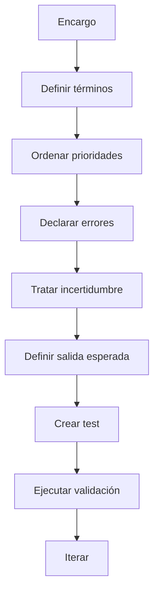

# Contratos semánticos temporales

Un repositorio práctico y formativo para diseñar, documentar, probar y evaluar contratos semánticos temporales al trabajar con modelos de IA.

## Qué es esto

Un **contrato semántico temporal** es un acuerdo explícito, limitado a una tarea o contexto concreto, que define:

- qué significan ciertos términos del encargo;
- qué prioridades mandan si hay conflicto;
- qué se considera error;
- cómo debe tratarse la incertidumbre;
- qué criterios permiten aceptar o rechazar una salida.

No es una ontología general ni una guía genérica de prompting. Es una pieza operativa para reducir ambigüedad y hacer que una interacción con IA sea más verificable.

## Objetivo

Ayudar a equipos, docentes, periodistas, diseñadores, juristas, personal sanitario e investigadores a pasar de instrucciones vagas a contratos verificables.

## Público

- Personas que ya usan IA y necesitan más control sobre el significado.
- Equipos que quieren estandarizar prompts y revisiones.
- Docentes y formadores que necesitan material didáctico.
- Organizaciones que quieren documentar criterios, límites y auditorías.

## Qué encontrarás

- Guía teórica sobre semántica, pragmática y prompting.
- Guía práctica para redactar contratos.
- Plantillas en Markdown, JSON y YAML.
- Casos aplicados en 6 dominios.
- Esquema JSON y scripts de validación.
- Tests automáticos y CI en GitHub Actions.
- Material formativo y checklist de auditoría semántica.
- Panel de traducción: “lo que decimos” vs “lo que deberíamos decir”.

## Panel de traducción interactivo

Web estática, sin dependencias, lista para servir desde GitHub Pages:
[`index.html`](index.html). Búsqueda en vivo, click para copiar al portapapeles,
fuente única de datos en [`assets/panel-traduccion.csv`](assets/panel-traduccion.csv).

Para activar el panel público:

1. En GitHub: **Settings → Pages → Source → Deploy from a branch → `main` / root**.
2. URL resultante: `https://remlenoir.github.io/cts/`.

## Uso rápido

### Leer primero
1. `docs/guia-teorica.md`
2. `docs/guia-practica.md`
3. `templates/contrato-semantico.md`

### Validar ejemplos

```bash
python -m pip install -U jsonschema pyyaml pytest
python scripts/run_example_tests.py
pytest
```

### Crear tu primer contrato
1. Duplica una plantilla de `templates/`.
2. Define el diccionario del encargo.
3. Ordena prioridades.
4. Declara errores.
5. Explica cómo tratar la incertidumbre.
6. Añade criterios de salida.
7. Crea un caso de prueba en `examples/`.

## Flujo recomendado



## Estructura del repositorio

```text
docs/        marco conceptual y operativo
templates/   plantillas reutilizables
examples/    casos por dominio
schemas/     validación estructural
scripts/     automatización
tests/       pruebas
assets/      diagramas y paneles
training/    material didáctico
```

## Principios del proyecto

- Claridad antes que retórica.
- Contratos pequeños antes que mega-instrucciones.
- Hechos, inferencias y vacíos bien separados.
- Evaluación visible desde el primer commit.
- Revisión humana en dominios sensibles.

## Licencia y autoría

Este repositorio se distribuye bajo **licencia dual**:

- **Código** (scripts, esquemas, HTML/CSS/JS, configuración): **MIT**.
  Consulta [`LICENSE`](LICENSE).
- **Contenido** (docs, ejemplos, plantillas, paneles, training, README, etc.):
  **CC BY-SA 4.0**. Consulta [`LICENSE-CONTENT`](LICENSE-CONTENT).

Cualquier reutilización debe conservar [`LICENSE`](LICENSE),
[`LICENSE-CONTENT`](LICENSE-CONTENT), [`NOTICE`](NOTICE) y
[`CITATION.cff`](CITATION.cff), y citar la autoría original. Las obras derivadas
del contenido **deben mantenerse bajo la misma licencia CC BY-SA 4.0**.

Para citar el repositorio en trabajos académicos o profesionales, usa el formato
del archivo [`CITATION.cff`](CITATION.cff).

## Cómo contribuir

Lee `CONTRIBUTING.md` y usa las plantillas de issues y pull requests.
Las revisiones de pull requests las asigna automáticamente
[`.github/CODEOWNERS`](.github/CODEOWNERS).
