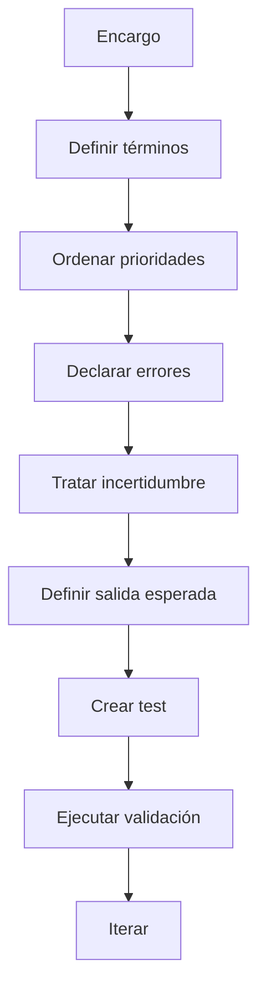

# Contratos semánticos temporales

Un repositorio práctico y formativo para diseñar, documentar, probar y evaluar contratos semánticos temporales al trabajar con modelos de IA.

## Qué es esto

Un **contrato semántico temporal** es un acuerdo explícito, limitado a una tarea o contexto concreto, que define:

- qué significan ciertos términos del encargo;
- qué prioridades mandan si hay conflicto;
- qué se considera error;
- cómo debe tratarse la incertidumbre;
- qué criterios permiten aceptar o rechazar una salida.

No es una ontología general ni una guía genérica de prompting. Es una pieza operativa para reducir ambigüedad y hacer que una interacción con IA sea más verificable.

## Objetivo

Ayudar a equipos, docentes, periodistas, diseñadores, juristas, personal sanitario e investigadores a pasar de instrucciones vagas a contratos verificables.

## Público

- Personas que ya usan IA y necesitan más control sobre el significado.
- Equipos que quieren estandarizar prompts y revisiones.
- Docentes y formadores que necesitan material didáctico.
- Organizaciones que quieren documentar criterios, límites y auditorías.

## Qué encontrarás

- Guía teórica sobre semántica, pragmática y prompting.
- Guía práctica para redactar contratos.
- Plantillas en Markdown, JSON y YAML.
- Casos aplicados en 6 dominios.
- Esquema JSON y scripts de validación.
- Tests automáticos y CI en GitHub Actions.
- Material formativo y checklist de auditoría semántica.
- **Biblioteca de transformaciones**: 29 secciones, 251 entradas, "lo que se suele decir" vs "lo que se debería decir" por dominio (contratación, contratación pública, Canarias/aduanas, código, datos, RRHH, finanzas, trading, seguridad/RGPD, etc.).

## Biblioteca interactiva

La pieza principal del repositorio es la **biblioteca de contratos
semánticos**: una colección por dominio de instrucciones reales mal formuladas
junto a su versión operativa. Está pensada para usar en el día a día.

- **Web estática**: [`index.html`](index.html). Busca en vivo, filtra por
  dominio, copia al portapapeles. Sin dependencias.
- **Fuente canónica**: [`biblioteca/biblioteca.md`](biblioteca/biblioteca.md).
  Editable a mano. Es lo que se navega en GitHub.
- **Datos estructurados** (generados): [`biblioteca/biblioteca.json`](biblioteca/biblioteca.json).
  Es lo que consume el frontend.

Para regenerar el JSON tras editar el markdown:

```bash
python scripts/build_biblioteca.py
```

URL pública (GitHub Pages): https://remlenoir.github.io/cts/

Para activar Pages si no lo está: **Settings → Pages → Source → Deploy from a
branch → `main` / root**.

## Uso rápido

### Como herramienta del día a día

1. Abre la biblioteca en https://remlenoir.github.io/cts/.
2. Busca por dominio o palabra clave (p. ej. "factura", "NDA", "DUA").
3. Copia la versión "lo que se debería decir" como base de tu prompt.
4. Ajusta los campos `[PENDIENTE]` / `[VERIFICAR]` con tus datos.

### Como repositorio versionado

```bash
python -m pip install -U jsonschema pyyaml pytest yamllint
python scripts/build_biblioteca.py    # regenera el JSON
python scripts/validate_contracts.py  # valida la capa formal opcional
python scripts/run_example_tests.py   # tests de los ejemplos
pytest                                # suite completa
```

### Capa formal opcional (para quien quiera contratos JSON validables)

Además de la biblioteca en markdown, el repo conserva una capa formal:

- [`schemas/contrato.schema.json`](schemas/contrato.schema.json): esquema JSON.
- [`templates/contrato-semantico.{md,json,yaml}`](templates/): punto de
  partida formal.
- [`examples/<dominio>/`](examples/): 6 ejemplos con `README.md` + `test_case.json`.

Es la pieza para quien quiera escribir contratos como JSON con validación
estructural. La biblioteca cubre el día a día sin necesidad de pasar por aquí.

## Flujo recomendado



## Estructura del repositorio

```text
biblioteca/     biblioteca (fuente .md + JSON generado)
index.html      frontend estático que consume el JSON
docs/           marco conceptual y operativo
templates/      plantillas reutilizables (capa formal)
examples/       casos por dominio (capa formal)
schemas/        validación estructural
scripts/        automatización (build_biblioteca, validate, etc.)
tests/          pruebas
assets/         diagramas
training/       material didáctico
```

## Principios del proyecto

- Claridad antes que retórica.
- Contratos pequeños antes que mega-instrucciones.
- Hechos, inferencias y vacíos bien separados.
- Evaluación visible desde el primer commit.
- Revisión humana en dominios sensibles.

## Licencia y autoría

Este repositorio se distribuye bajo **licencia dual**:

- **Código** → MIT, en [`LICENSE`](LICENSE).
- **Contenido** → CC BY-SA 4.0, en [`LICENSE-CONTENT`](LICENSE-CONTENT).

Las reglas concretas de qué licencia aplica a cada archivo y qué obligaciones
implica la redistribución están en [`LICENSING.md`](LICENSING.md). Atribución y
política de incumplimientos en [`NOTICE`](NOTICE). Cita estructurada para uso
académico en [`CITATION.cff`](CITATION.cff).

## Cómo contribuir

Lee `CONTRIBUTING.md` y usa las plantillas de issues y pull requests.
Las revisiones de pull requests las asigna automáticamente
[`.github/CODEOWNERS`](.github/CODEOWNERS).
